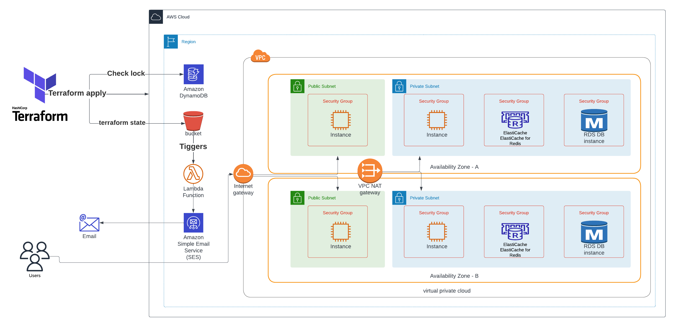

# Bastion Host Terraform

Provide Secure instance in private subnets can connect from instance in public subnet 
from two availability zones

## Services

- VPC
- Internet gateway
- Public subents
- Private subnets
- Two AZs 
- Two security groups
- Instances in public subnet
- Instances in private subnet
- Nat getway
- AWS Secrets Manager
- Lambda 
- S3 bucket
- Dynamo db
- RDS
- Elastic cache Redis
- SES
